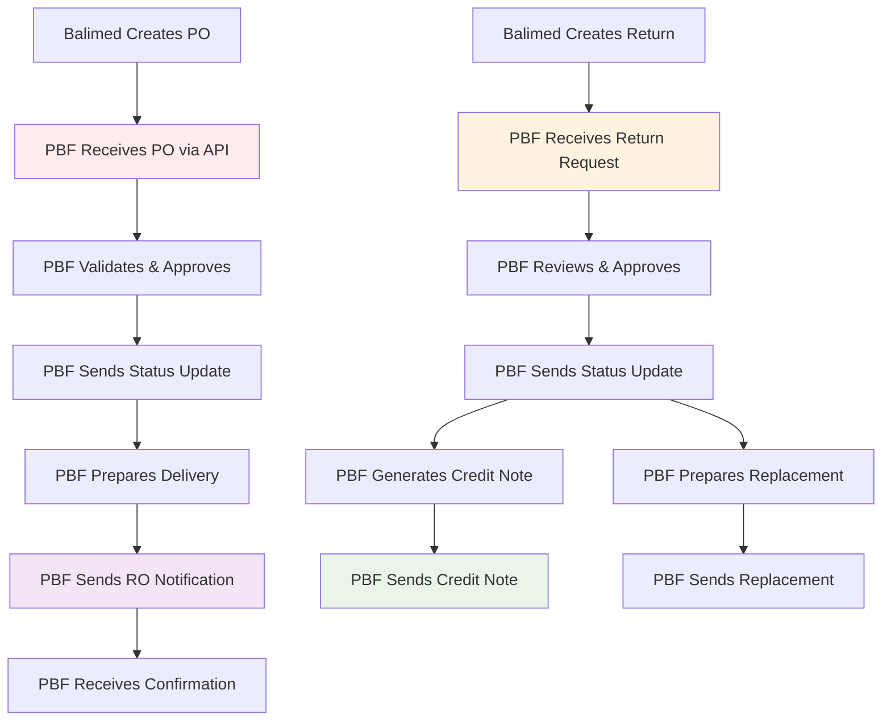

# API Specifications for PBF Distributor Integration

## Requirements for PT. PBF Distributor System Development

### Overview

Dokumentasi ini berisi spesifikasi API yang **harus disiapkan oleh programmer PT. PBF** untuk integrasi otomatis dengan Sistem Farmasi Balimed. Setiap endpoint dan fitur yang dijelaskan dalam dokumen ini perlu diimplementasikan di sistem distributor untuk memungkinkan komunikasi seamless dengan Balimed.

---

## Table of Contents

### 📋 [1. Purchase Order API](01-purchase-order-api.md)

**Yang Harus Disiapkan PBF**:

**Endpoints yang Harus Dibuat**:
-   `POST /api/distributor/purchase-orders` - **Terima PO dari Balimed**
-   `GET /api/distributor/purchase-orders/{po}` - **Berikan detail PO**

**Endpoints yang Harus Dipanggil PBF**:
-   `PATCH /api/balimed/purchase-orders/{po}/status` - **Kirim update status ke Balimed**

**Fitur yang Harus Diimplementasi**:
-   Penerimaan PO secara otomatis dari Balimed
-   Validasi dan approval PO (approved/rejected/partial)
-   Pengiriman status update real-time ke Balimed
-   Support multi-location untuk berbagai rumah sakit

---

### 📦 [2. Receiving Order API](02-receiving-order-api.md)

**Yang Harus Disiapkan PBF**:

**Endpoints yang Harus Dipanggil PBF**:
-   `POST /api/balimed/receiving-orders` - **Kirim notifikasi pengiriman ke Balimed**

**Endpoints yang Harus Dibuat**:
-   `POST /api/distributor/receiving-orders/{ro}/confirmation` - **Terima konfirmasi dari Balimed**
-   `POST /api/distributor/receiving-orders/{ro}/discrepancy` - **Terima laporan masalah dari Balimed**

**Fitur yang Harus Diimplementasi**:
-   Pengiriman notifikasi delivery dengan informasi batch lengkap
-   Penanganan partial delivery dan discrepancy dari Balimed
-   Integrasi dengan sistem invoice dan finance distributor
-   Update status pengiriman berdasarkan konfirmasi Balimed

---

### 🔄 [3. Retur Distributor API](03-retur-distributor-api.md)

**Yang Harus Disiapkan PBF**:

**Endpoints yang Harus Dibuat**:
-   `POST /api/distributor/returns` - **Terima request retur dari Balimed**
-   `DELETE /api/distributor/returns/{return}` - **Terima pembatalan retur dari Balimed**

**Endpoints yang Harus Dipanggil PBF**:
-   `PATCH /api/balimed/returns/{return}/status` - **Kirim update status retur ke Balimed**

**Fitur yang Harus Diimplementasi**:
-   Penerimaan dan processing request retur otomatis
-   Penanganan berbagai alasan retur (damaged, expired, excess, dll)
-   Penerimaan foto evidence dan dokumentasi pendukung
-   Workflow approval retur dan tracking status

---

### 💰 [4. Faktur Retur API](04-faktur-retur-api.md)

**Yang Harus Disiapkan PBF**:

**Endpoints yang Harus Dipanggil PBF**:
-   `POST /api/balimed/credit-notes` - **Kirim credit note ke Balimed**

**Endpoints yang Harus Dibuat**:
-   `POST /api/distributor/credit-notes/{cn}/verification` - **Terima verifikasi dari Balimed**
-   `POST /api/distributor/credit-notes/{cn}/dispute` - **Terima dispute dari Balimed**

**Fitur yang Harus Diimplementasi**:
-   Pembuatan dan pengiriman credit note otomatis
-   Penerimaan verifikasi credit note dari Balimed
-   Penanganan dispute dan resolution
-   Integrasi dengan sistem finance dan accounts payable distributor

---

### ✅ [5. Pemenuhan Retur API](05-pemenuhan-retur-api.md)

**Yang Harus Disiapkan PBF**:

**Endpoints yang Harus Dipanggil PBF**:
-   `POST /api/balimed/return-fulfillments` - **Kirim notifikasi replacement ke Balimed**

**Endpoints yang Harus Dibuat**:
-   `POST /api/distributor/return-fulfillments/{id}/confirmation` - **Terima konfirmasi dari Balimed**

**Endpoints yang Harus Dipanggil PBF**:
-   `GET /api/balimed/return-fulfillments/{id}/status` - **Cek status dari Balimed**

**Fitur yang Harus Diimplementasi**:
-   Management pengiriman replacement goods
-   Penanganan exchange dan upgrade produk
-   Quality assurance dan batch tracking
-   Workflow closure untuk kasus retur

---

### 📊 [6. Stock Tracking API](06-stock-tracking-api.md)

**Yang Harus Disiapkan PBF**:

**Endpoints yang Harus Dibuat**:
-   `GET /api/distributor/stock` - **Berikan informasi stok terbaru**
-   `GET /api/distributor/stock/{product_code}` - **Berikan detail stok produk spesifik**
-   `POST /api/distributor/stock/reserve` - **Terima request reservasi stok**

**Endpoints yang Harus Dipanggil PBF**:
-   `POST /api/balimed/stock-updates` - **Kirim notifikasi perubahan stok real-time**

**Fitur yang Harus Diimplementasi**:
-   Real-time stock monitoring dan updates
-   Batch tracking dengan FIFO/FEFO management
-   Stock reservation system untuk PO
-   Historical stock movement tracking

---

## 🏗️ Technical Requirements for PBF

### Database yang Perlu Disiapkan PBF

PBF perlu menyiapkan struktur database yang dapat menerima dan menyimpan data dari Balimed:

```
📊 Tables untuk Purchase Orders
├── distributor_po_header (Header PO dari Balimed)
├── distributor_po_detail (Detail item PO dari Balimed)
└── distributor_po_status (Status tracking PO)

📋 Tables untuk Returns
├── distributor_returns_header (Header retur dari Balimed)
├── distributor_returns_detail (Detail item retur)
└── distributor_returns_status (Status tracking retur)

🔗 Master Data yang Harus Sinkron
├── balimed_hospitals (Data rumah sakit Balimed)
├── product_mapping (Mapping produk PBF-Balimed)
├── unit_conversions (Konversi satuan)
└── price_contracts (Kontrak harga)
```

### Integration Flow - Perspektif PBF



---

## 🔧 Implementation Guide untuk PBF

### 1. Authentication & Security yang Harus Disiapkan PBF

```http
# Headers yang Harus Diterima PBF
Authorization: Bearer {api_token}
Content-Type: application/json
X-Hospital-Code: BALIMED_DENPASAR
X-Request-ID: {unique_request_id}
```

**Requirement Security untuk PBF**:

-   **WAJIB** HTTPS untuk semua komunikasi
-   **WAJIB** validasi Bearer token dengan expiry 24-jam
-   **WAJIB** implementasi rate limiting: 1000 requests/hour per endpoint
-   **WAJIB** IP whitelisting untuk Balimed servers
-   **WAJIB** HMAC-SHA256 signing untuk operasi kritis

### 2. Error Handling

```json
{
    "status": "error",
    "error_code": "VALIDATION_ERROR",
    "message": "Data tidak valid",
    "errors": [
        {
            "field": "header.distributor_id",
            "message": "Distributor ID tidak ditemukan"
        }
    ],
    "timestamp": "2024-12-15T10:30:00+07:00"
}
```

**Common Error Codes**:

-   `VALIDATION_ERROR` - Input validation failed
-   `NOT_FOUND` - Resource not found
-   `UNAUTHORIZED` - Invalid credentials
-   `BUSINESS_RULE_VIOLATION` - Business logic violation
-   `SYSTEM_ERROR` - Internal server error

### 3. Status Codes & Workflows

#### Purchase Order Status Flow

```
DRAFT → SENT → RECEIVED → APPROVED/REJECTED → DELIVERED
```

#### Return Status Flow

```
CREATED → SENT → RECEIVED → UNDER_REVIEW → APPROVED/REJECTED → COMPLETED
```

#### Stock Impact Rules

-   **PO**: No stock impact until RO confirmed
-   **RO**: Stock increases upon confirmation
-   **Return**: Stock decreases when physically collected
-   **Replacement**: Stock increases upon confirmation

---

## 📊 Business Rules Summary

### 1. Number Formats

-   **PO**: `PO/YY/MM/NNNN/LOCATION`
-   **RO**: `RO/YY/MM/NNNN/LOCATION`
-   **Return**: `RTN/YY/MM/NNNN/LOCATION`
-   **Credit Note**: `CN/DIST_CODE/YY/NNN[-REVN]`
-   **Replacement**: `RRD/YY/MM/NNNN/LOCATION`

### 2. Key Validations

-   All pharmaceutical items require batch numbers and expiry dates
-   Quantities cannot exceed available stock for returns
-   Expiry dates must be future dates and reasonable
-   Prices must match contracted rates (±5% tolerance)
-   Return reasons must be valid and documented

### 3. Approval Workflows

-   **Internal Approval**: Required for PO, Returns, Credit Notes
-   **Distributor Approval**: Required for Returns, Replacements
-   **Finance Approval**: Required for Credit Notes, Payment adjustments

---

## 🚀 Quick Start Guide

### Step 1: Setup Environment PBF

1. **WAJIB** Setup API endpoints sesuai spesifikasi
2. **WAJIB** Install SSL certificates untuk HTTPS
3. **WAJIB** Configure IP whitelisting untuk Balimed
4. **WAJIB** Test semua authentication endpoints

### Step 2: Sinkronisasi Master Data

1. **WAJIB** Sinkronisasi data produk dengan Balimed
2. **WAJIB** Mapping kode produk PBF ke kode Balimed
3. **WAJIB** Validasi unit dan konversi satuan
4. **WAJIB** Test integritas data

### Step 3: Testing Integrasi

1. **WAJIB** Test penerimaan dan approval PO
2. **WAJIB** Test pengiriman RO dan konfirmasi
3. **WAJIB** Test penerimaan dan processing retur
4. **WAJIB** Test credit note dan replacement workflows

### Step 4: Deployment Production

1. **WAJIB** Setup monitoring dan alerting
2. **WAJIB** Setup error logging dan reporting
3. **WAJIB** Training staff PBF untuk workflow baru
4. **WAJIB** Monitor performance metrics

---

## 📞 Support & Contact

### Development Team

-   **Lead Developer**: Team Lead Farmasi Balimed
-   **Database Admin**: DBA Team Balimed
-   **Integration Specialist**: IT Integration Team

### Distributor Contact

-   **Technical Contact**: PT. PBF IT Team
-   **Business Contact**: PT. PBF Account Manager
-   **Support Hotline**: (to be provided)

---

## 📈 Monitoring & Analytics

### Key Performance Indicators (KPIs)

-   API response times (target: <2 seconds)
-   Integration success rate (target: >99%)
-   Data synchronization accuracy (target: 100%)
-   Return processing time (target: <24 hours)
-   Credit note verification time (target: <2 hours)

### Health Check Endpoints

```http
GET /api/health
GET /api/status
GET /api/version
```

### Logging Requirements

-   All API requests/responses with timestamps
-   Authentication attempts and failures
-   Business rule violations
-   System errors with stack traces
-   Performance metrics and response times

---

## 🔄 Version History

| Version | Date       | Changes                        |
| ------- | ---------- | ------------------------------ |
| 1.0.0   | 2024-12-15 | Initial API specification      |
| 1.0.1   | 2024-12-16 | Added error handling details   |
| 1.0.2   | 2024-12-17 | Enhanced security requirements |

---

## 📋 Implementation Checklist

### Phase 1: Core Integration (Weeks 1-4)

-   [ ] Purchase Order API implementation
-   [ ] Receiving Order API implementation
-   [ ] Basic authentication and security
-   [ ] Error handling and logging
-   [ ] Unit testing

### Phase 2: Return Management (Weeks 5-8)

-   [ ] Retur Distributor API implementation
-   [ ] Faktur Retur API implementation
-   [ ] Dispute handling workflow
-   [ ] Integration testing

### Phase 3: Fulfillment & Optimization (Weeks 9-12)

-   [ ] Pemenuhan Retur API implementation
-   [ ] Performance optimization
-   [ ] Monitoring and alerting setup
-   [ ] User training and documentation
-   [ ] Production deployment

### Phase 4: Enhancement (Ongoing)

-   [ ] Advanced analytics and reporting
-   [ ] Mobile app integration
-   [ ] Automated reconciliation
-   [ ] Performance tuning

---

---

## 📝 Summary Requirement untuk PBF

### Yang WAJIB Disiapkan oleh Programmer PT. PBF:

#### 1. **Endpoints yang Harus DIBUAT di Sistem PBF** (untuk menerima dari Balimed):
- `POST /api/distributor/purchase-orders` - Terima PO dari Balimed
- `GET /api/distributor/purchase-orders/{po}` - Berikan detail PO
- `POST /api/distributor/returns` - Terima request retur dari Balimed
- `DELETE /api/distributor/returns/{return}` - Terima pembatalan retur
- `POST /api/distributor/receiving-orders/{ro}/confirmation` - Terima konfirmasi penerimaan
- `POST /api/distributor/receiving-orders/{ro}/discrepancy` - Terima laporan masalah
- `POST /api/distributor/credit-notes/{cn}/verification` - Terima verifikasi credit note
- `POST /api/distributor/credit-notes/{cn}/dispute` - Terima dispute
- `POST /api/distributor/return-fulfillments/{id}/confirmation` - Terima konfirmasi replacement
- `GET /api/distributor/stock` - **Berikan informasi stok terbaru**
- `GET /api/distributor/stock/{product_code}` - **Berikan detail stok produk spesifik**
- `POST /api/distributor/stock/reserve` - **Terima request reservasi stok**

#### 2. **Endpoints Balimed yang Harus DIPANGGIL oleh PBF** (untuk mengirim ke Balimed):
- `PATCH /api/balimed/purchase-orders/{po}/status` - Kirim update status PO
- `POST /api/balimed/receiving-orders` - Kirim notifikasi pengiriman
- `PATCH /api/balimed/returns/{return}/status` - Kirim update status retur
- `POST /api/balimed/credit-notes` - Kirim credit note
- `POST /api/balimed/return-fulfillments` - Kirim notifikasi replacement
- `GET /api/balimed/return-fulfillments/{id}/status` - Cek status replacement
- `POST /api/balimed/stock-updates` - **Kirim notifikasi perubahan stok real-time**

#### 3. **Security & Authentication yang WAJIB**:
- HTTPS untuk semua komunikasi
- Bearer token authentication
- Validasi X-Hospital-Code header
- IP whitelisting untuk server Balimed
- HMAC-SHA256 signing untuk operasi kritis

#### 4. **Database yang Perlu Disiapkan**:
- Tables untuk menyimpan data PO dari Balimed
- Tables untuk tracking status dan workflow
- Master data mapping produk PBF-Balimed
- Tables untuk retur dan credit note management
- **Tables untuk real-time stock management**
- **Tables untuk batch tracking dan FIFO/FEFO**
- **Tables untuk stock reservation system**

---

_Dokumen ini berisi spesifikasi lengkap yang **HARUS diimplementasikan oleh programmer PT. PBF** untuk integrasi dengan Sistem Farmasi Balimed. Setiap endpoint dan fitur yang dijelaskan adalah requirement wajib untuk komunikasi seamless._
