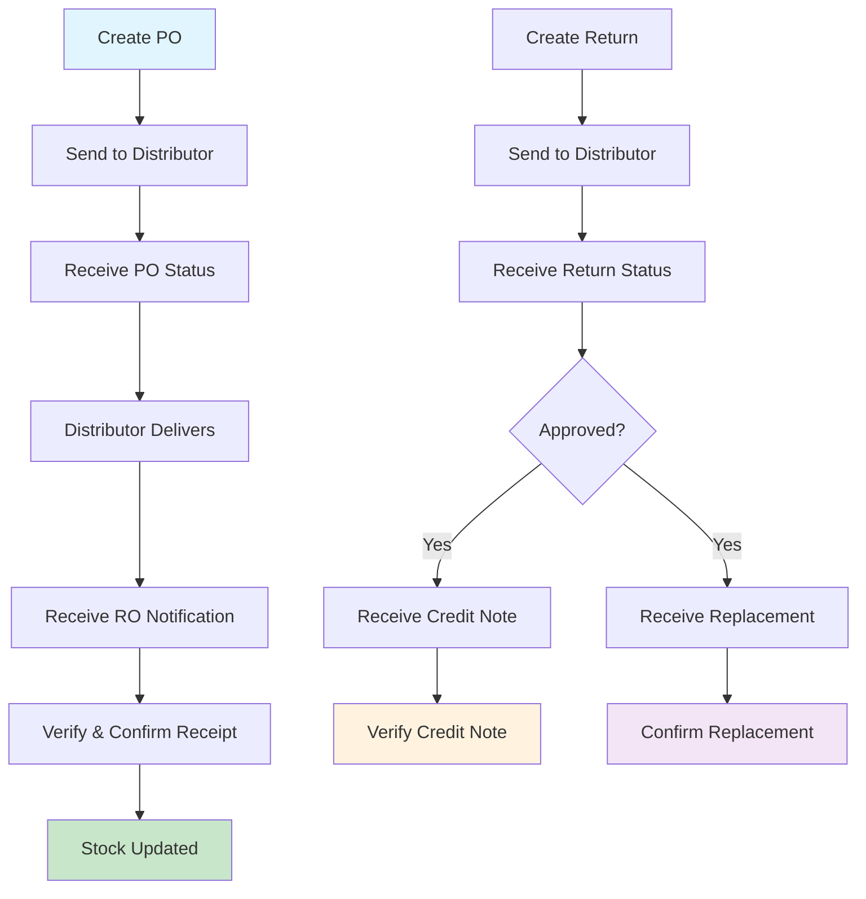

# API Specifications for Distributor Integration

## Sistem Farmasi Balimed ↔ PT. PBF Distributor

### Overview

Dokumentasi ini berisi spesifikasi API lengkap untuk integrasi otomatis antara Sistem Farmasi Balimed dengan Sistem Distributor PT. PBF. Integrasi ini mencakup seluruh siklus supply chain management dari Purchase Order hingga Pemenuhan Retur.

---

## Table of Contents

### 📋 [1. Purchase Order API](01-purchase-order-api.md)

**Database**: `m_farmasi_po`, `t_farmasi_po`

**Key Features**:

-   Send PO to distributor automatically
-   Receive PO status updates (approved/rejected/partial)
-   Real-time stock level monitoring
-   Multi-location hospital support

**Main Endpoints**:

-   `POST /api/distributor/purchase-orders` - Send PO
-   `PATCH /api/balimed/purchase-orders/{po}/status` - Receive status update
-   `GET /api/distributor/purchase-orders/{po}` - Get PO details

---

### 📦 [2. Receiving Order API](02-receiving-order-api.md)

**Database**: `m_farmasi_ro`, `t_farmasi_ro`

**Key Features**:

-   Receive delivery notifications with batch info
-   Handle partial deliveries and discrepancies
-   Automatic stock updates with FIFO/FEFO
-   Invoice verification and finance integration

**Main Endpoints**:

-   `POST /api/balimed/receiving-orders` - Receive delivery notification
-   `POST /api/distributor/receiving-orders/{ro}/confirmation` - Send confirmation
-   `POST /api/distributor/receiving-orders/{ro}/discrepancy` - Report issues

---

### 🔄 [3. Retur Distributor API](03-retur-distributor-api.md)

**Database**: `m_farmasi_retur_d`, `t_farmasi_retur_d`

**Key Features**:

-   Automated return request processing
-   Multiple return reasons (damaged, expired, excess, etc.)
-   Photo evidence and documentation support
-   Return status tracking and approval workflow

**Main Endpoints**:

-   `POST /api/distributor/returns` - Send return request
-   `PATCH /api/balimed/returns/{return}/status` - Receive status update
-   `DELETE /api/distributor/returns/{return}` - Cancel return

---

### 💰 [4. Faktur Retur API](04-faktur-retur-api.md)

**Database**: `m_farmasi_retur_d_faktur`, `t_farmasi_faktur_retur_d`

**Key Features**:

-   Credit note processing and verification
-   Dispute handling and resolution
-   Finance system integration
-   Accounts payable adjustments

**Main Endpoints**:

-   `POST /api/balimed/credit-notes` - Receive credit note
-   `POST /api/distributor/credit-notes/{cn}/verification` - Send verification
-   `POST /api/distributor/credit-notes/{cn}/dispute` - Handle disputes

---

### ✅ [5. Pemenuhan Retur API](05-pemenuhan-retur-api.md)

**Database**: `m_farmasi_receiving_retur_d`, `t_farmasi_receiving_retur_d`

**Key Features**:

-   Replacement goods delivery management
-   Exchange and upgrade handling
-   Quality assurance and batch tracking
-   Return case closure workflow

**Main Endpoints**:

-   `POST /api/balimed/return-fulfillments` - Receive replacement notification
-   `POST /api/distributor/return-fulfillments/{id}/confirmation` - Send confirmation
-   `GET /api/balimed/return-fulfillments/{id}/status` - Track status

---

## 🏗️ Technical Architecture

### Database Architecture

```
📊 Master Tables (m_farmasi_*)
├── m_farmasi_po (Purchase Orders)
├── m_farmasi_ro (Receiving Orders)
├── m_farmasi_retur_d (Returns to Distributor)
├── m_farmasi_retur_d_faktur (Credit Notes)
└── m_farmasi_receiving_retur_d (Replacement Receipts)

📋 Detail Tables (t_farmasi_*)
├── t_farmasi_po (PO Line Items)
├── t_farmasi_ro (RO Line Items)
├── t_farmasi_retur_d (Return Line Items)
├── t_farmasi_faktur_retur_d (Credit Note Line Items)
└── t_farmasi_receiving_retur_d (Replacement Line Items)

🔗 Reference Tables
├── m_farmasi_distributor (Distributor Master)
├── m_farmasi_barang (Product Master)
├── m_farmasi_lokasi_barang (Stock Locations)
└── m_ref (Reference Codes & Status)
```

### Integration Flow



---

## 🔧 Implementation Guide

### 1. Authentication & Security

```http
# Required Headers
Authorization: Bearer {api_token}
Content-Type: application/json
X-Hospital-Code: BALIMED_DENPASAR
X-Request-ID: {unique_request_id}
```

**Security Requirements**:

-   HTTPS mandatory for all communications
-   Bearer token authentication with 24-hour expiry
-   Rate limiting: 1000 requests/hour per endpoint
-   IP whitelisting for both systems
-   HMAC-SHA256 signing for critical operations

### 2. Error Handling

```json
{
    "status": "error",
    "error_code": "VALIDATION_ERROR",
    "message": "Data tidak valid",
    "errors": [
        {
            "field": "header.distributor_id",
            "message": "Distributor ID tidak ditemukan"
        }
    ],
    "timestamp": "2024-12-15T10:30:00+07:00"
}
```

**Common Error Codes**:

-   `VALIDATION_ERROR` - Input validation failed
-   `NOT_FOUND` - Resource not found
-   `UNAUTHORIZED` - Invalid credentials
-   `BUSINESS_RULE_VIOLATION` - Business logic violation
-   `SYSTEM_ERROR` - Internal server error

### 3. Status Codes & Workflows

#### Purchase Order Status Flow

```
DRAFT → SENT → RECEIVED → APPROVED/REJECTED → DELIVERED
```

#### Return Status Flow

```
CREATED → SENT → RECEIVED → UNDER_REVIEW → APPROVED/REJECTED → COMPLETED
```

#### Stock Impact Rules

-   **PO**: No stock impact until RO confirmed
-   **RO**: Stock increases upon confirmation
-   **Return**: Stock decreases when physically collected
-   **Replacement**: Stock increases upon confirmation

---

## 📊 Business Rules Summary

### 1. Number Formats

-   **PO**: `PO/YY/MM/NNNN/LOCATION`
-   **RO**: `RO/YY/MM/NNNN/LOCATION`
-   **Return**: `RTN/YY/MM/NNNN/LOCATION`
-   **Credit Note**: `CN/DIST_CODE/YY/NNN[-REVN]`
-   **Replacement**: `RRD/YY/MM/NNNN/LOCATION`

### 2. Key Validations

-   All pharmaceutical items require batch numbers and expiry dates
-   Quantities cannot exceed available stock for returns
-   Expiry dates must be future dates and reasonable
-   Prices must match contracted rates (±5% tolerance)
-   Return reasons must be valid and documented

### 3. Approval Workflows

-   **Internal Approval**: Required for PO, Returns, Credit Notes
-   **Distributor Approval**: Required for Returns, Replacements
-   **Finance Approval**: Required for Credit Notes, Payment adjustments

---

## 🚀 Quick Start Guide

### Step 1: Environment Setup

1. Configure API endpoints and credentials
2. Set up SSL certificates for HTTPS
3. Configure IP whitelisting
4. Test authentication endpoints

### Step 2: Master Data Sync

1. Synchronize distributor information
2. Map product codes between systems
3. Validate unit codes and conversions
4. Test data integrity

### Step 3: Integration Testing

1. Test PO creation and approval flow
2. Test RO delivery and confirmation
3. Test return creation and processing
4. Test credit note and replacement workflows

### Step 4: Production Deployment

1. Configure monitoring and alerting
2. Set up error logging and reporting
3. Train staff on new workflows
4. Monitor performance metrics

---

## 📞 Support & Contact

### Development Team

-   **Lead Developer**: Team Lead Farmasi Balimed
-   **Database Admin**: DBA Team Balimed
-   **Integration Specialist**: IT Integration Team

### Distributor Contact

-   **Technical Contact**: PT. PBF IT Team
-   **Business Contact**: PT. PBF Account Manager
-   **Support Hotline**: (to be provided)

---

## 📈 Monitoring & Analytics

### Key Performance Indicators (KPIs)

-   API response times (target: <2 seconds)
-   Integration success rate (target: >99%)
-   Data synchronization accuracy (target: 100%)
-   Return processing time (target: <24 hours)
-   Credit note verification time (target: <2 hours)

### Health Check Endpoints

```http
GET /api/health
GET /api/status
GET /api/version
```

### Logging Requirements

-   All API requests/responses with timestamps
-   Authentication attempts and failures
-   Business rule violations
-   System errors with stack traces
-   Performance metrics and response times

---

## 🔄 Version History

| Version | Date       | Changes                        |
| ------- | ---------- | ------------------------------ |
| 1.0.0   | 2024-12-15 | Initial API specification      |
| 1.0.1   | 2024-12-16 | Added error handling details   |
| 1.0.2   | 2024-12-17 | Enhanced security requirements |

---

## 📋 Implementation Checklist

### Phase 1: Core Integration (Weeks 1-4)

-   [ ] Purchase Order API implementation
-   [ ] Receiving Order API implementation
-   [ ] Basic authentication and security
-   [ ] Error handling and logging
-   [ ] Unit testing

### Phase 2: Return Management (Weeks 5-8)

-   [ ] Retur Distributor API implementation
-   [ ] Faktur Retur API implementation
-   [ ] Dispute handling workflow
-   [ ] Integration testing

### Phase 3: Fulfillment & Optimization (Weeks 9-12)

-   [ ] Pemenuhan Retur API implementation
-   [ ] Performance optimization
-   [ ] Monitoring and alerting setup
-   [ ] User training and documentation
-   [ ] Production deployment

### Phase 4: Enhancement (Ongoing)

-   [ ] Advanced analytics and reporting
-   [ ] Mobile app integration
-   [ ] Automated reconciliation
-   [ ] Performance tuning

---

_Dokumen ini dibuat berdasarkan analisis mendalam terhadap struktur database dan business logic Sistem Farmasi Balimed. Implementasi API ini akan memungkinkan integrasi seamless untuk otomatisasi complete pharmaceutical supply chain management._
